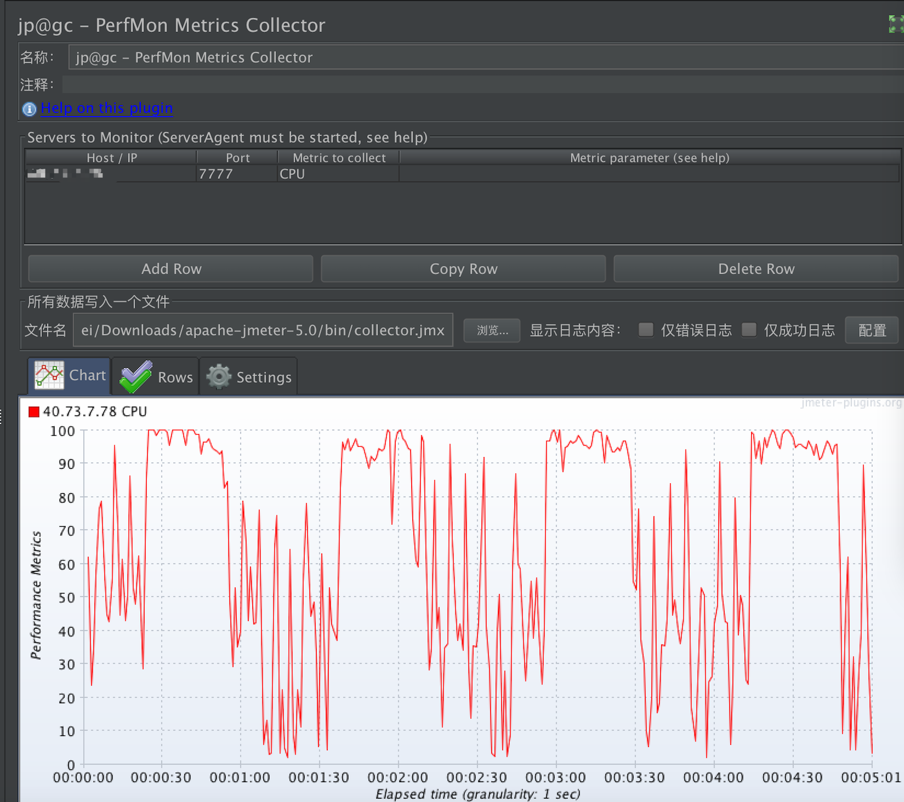

# JMETER-CITADEMO

 The project simply implements the performance of the listening server through the jmeter plug-in


## Getting Started

Install serverAgent on the server side：Upload serveragent-2.2.1.rar in the plugin folder and unzip it.
Enter the uncompressed folder, run the command:

```
./startAgent.sh
```


 to start serverAgent（Prerequisite: JDK has been installed on the server）


Copy the jmeterplugins-standard.jar from the plugins folder to the jmeter installation directory \lib\ext


The jmeter client creates a request for peerCount


The jmeter client creates a listener perfMon Metrics Collector and selects what to listen to (CPU, Memory, Disk I/O, Network I/O, and so on). The following example gets the CPU information for the server.


The jmeter client creates an aggregate report that retrieves data such as response time, throughput, and so on


The jmeter client thread group sets the appropriate number of threads, hot start time, and run time


Jmeter script can be run to obtain real-time server-side performance data, as well as the number of requests, TPS and average response time of the pressure test, as shown in the figure below:



## License

MIT